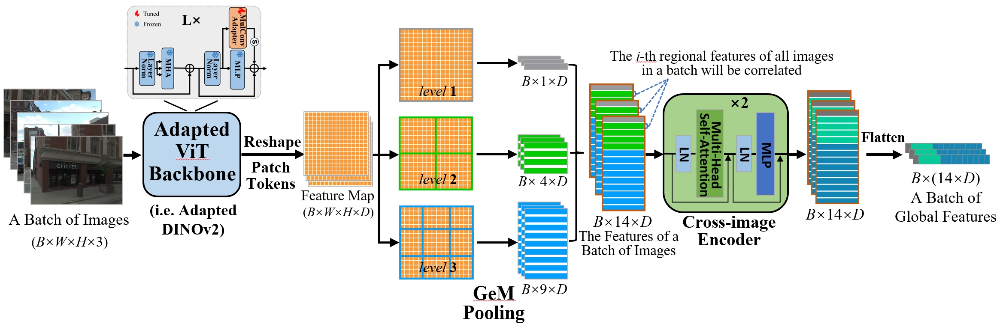

# CricaVPR
This is the official repository for the CVPR 2024 paper "[CricaVPR: Cross-image Correlation-aware Representation Learning for Visual Place Recognition](https://arxiv.org/pdf/2402.19231.pdf)".



## Getting Started

This repo follows the framework of [GSV-Cities](https://github.com/amaralibey/gsv-cities) for training, and the [Visual Geo-localization Benchmark](https://github.com/gmberton/deep-visual-geo-localization-benchmark) for evaluation. You can download the GSV-Cities datasets [HERE](https://www.kaggle.com/datasets/amaralibey/gsv-cities), and refer to [VPR-datasets-downloader](https://github.com/gmberton/VPR-datasets-downloader) to prepare test datasets.

The test dataset should be organized in a directory tree as such:

```
├── datasets_vg
    └── datasets
        └── pitts30k
            └── images
                ├── train
                │   ├── database
                │   └── queries
                ├── val
                │   ├── database
                │   └── queries
                └── test
                    ├── database
                    └── queries
```

Before training, you should download the pre-trained foundation model DINOv2(ViT-B/14) [HERE](https://dl.fbaipublicfiles.com/dinov2/dinov2_vitb14/dinov2_vitb14_pretrain.pth).

## Train
```
python3 train.py --eval_datasets_folder=/path/to/your/datasets_vg/datasets --eval_dataset_name=pitts30k --foundation_model_path=/path/to/pre-trained/dinov2_vitb14_pretrain.pth --epochs_num=10
```

## Test

To evaluate the trained model:

```
python3 eval.py --eval_datasets_folder=/path/to/your/datasets_vg/datasets --eval_dataset_name=pitts30k --resume=/path/to/trained/model/CricaVPR.pth
```

To add PCA:

```
python3 eval.py --eval_datasets_folder=/path/to/your/datasets_vg/datasets --eval_dataset_name=pitts30k --resume=/path/to/trained/model/CricaVPR.pth --pca_dim=4096 --pca_dataset_folder=pitts30k/images/train
```

## Trained Model

You can directly download the trained model [HERE](https://drive.google.com/file/d/171lCcxZFFnvEvo88ntIwELeBegcMTEJs/view?usp=sharing).

## Related Work

**Our another work (two-stage VPR based on DINOv2) SelaVPR achieved SOTA performance on several datasets. The code is released at [HERE](https://github.com/Lu-Feng/SelaVPR).**

## Acknowledgements

Parts of this repo are inspired by the following repositories:

[GSV-Cities](https://github.com/amaralibey/gsv-cities)

[Visual Geo-localization Benchmark](https://github.com/gmberton/deep-visual-geo-localization-benchmark)

[DINOv2](https://github.com/facebookresearch/dinov2)

## Citation

If you find this repo useful for your research, please consider leaving a star⭐️ and citing the paper

```
@inproceedings{lu2024cricavpr,
  title={CricaVPR: Cross-image Correlation-aware Representation Learning for Visual Place Recognition},
  author={Lu, Feng and Lan, Xiangyuan and Zhang, Lijun and Jiang, Dongmei and Wang, Yaowei and Yuan, Chun},
  booktitle={Proceedings of the IEEE/CVF Conference on Computer Vision and Pattern Recognition (CVPR)},
  month={June},
  year={2024}
}
```